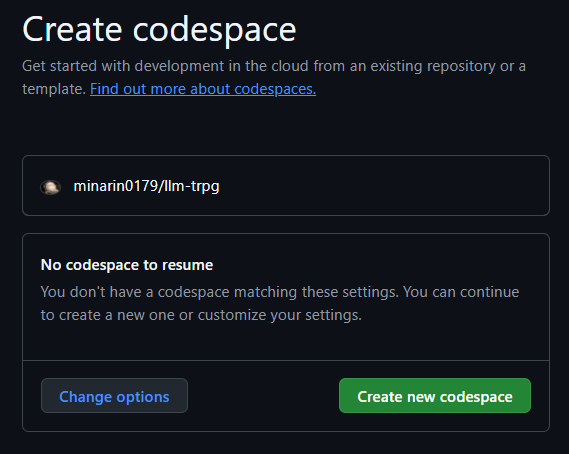

# マルチエージェントによる TRPG GM システム


## ディレクトリ構成
.  
├── character : キャラクターシート  
├── rulebook : ルールブック  
├── scenario : シナリオ  
└── src : 本体  

## 環境構築手順
### 1. 仮想環境の作成
Github Codespace, Devcontainer に対応


ブラウザで[Codespace](https://github.co.jp/features/codespaces)で開く (無料枠で動きます) 



初回起動はセットアップが走るので時間が掛かる

### 2. 環境変数の設定
.env.sampleを.envにコピーして書き換える  
```bash
cp src/.env.sample src/.env
```  

あとは.env内のOPENAI_API_KEYを設定する
```
OPENAI_API_KEY=(ここにAPIキーを貼り付け)
BCDICE_API_URL="https://bcdice.onlinesession.app"
```

## 使用手順
以下のコマンドで実行
```bash
python src/main.py 
```
システムを停止する際は`exit`と入力
